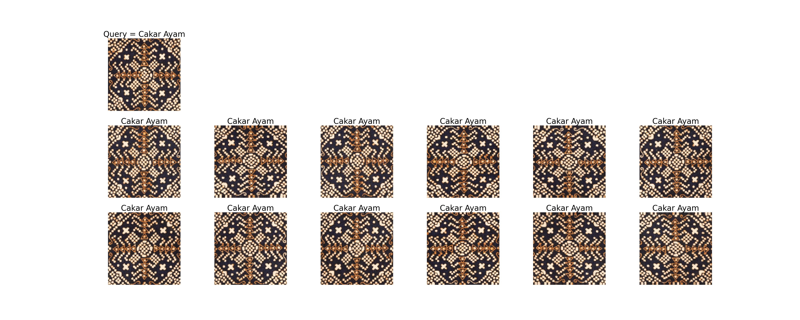
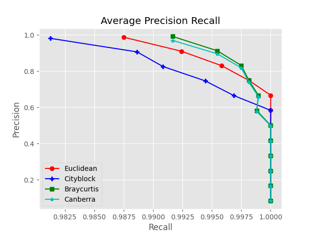
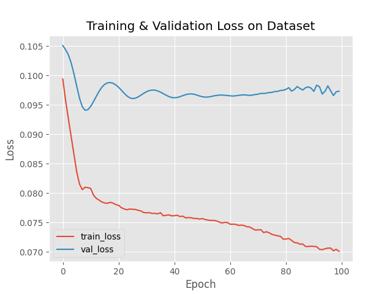

# Image retrieval using Autoencoder

## Abstract
The demand for image retrieval research has surged due to the proliferation of visual data online. Traditional content-based searches are hindered by high data dimensionality and the semantic gap in image understanding. This study utilizes Autoencoders, a type of deep learning model that simplifies visual data into more manageable formats, to enhance image search efficiency. Focusing on the culturally significant Batik Nitik 960 dataset, the research tackles pattern recognition challenges, crafting a model that encodes images for easier retrieval based on visual similarities. Findings reveal Autoencoders' capacity for sophisticated data analysis, beneficial for e-commerce, education, and heritage conservation, underscoring the role of technology in preserving and promoting cultural heritage.

## Performance Plots

### Average Precision-Recall (APR)

This plot shows the performance of our model in terms of precision and recall across different thresholds, which is crucial for understanding the effectiveness of the retrieval system.

### Training Loss

The loss plot illustrates the model's learning progress over epochs, showing reductions in loss as the model better fits the data.

## Project Description
This Autoencoder program is designed to facilitate Batik image retrieval utilizing machine learning techniques. It allows users to efficiently and effectively find similar Batik images from a large database.
## Features
- **Efficient Image Encoding**: Reduces image dimensionality while retaining key visual features for retrieval.
- **High Similarity Matching**: Uses encoded features to search for and retrieve images with high visual similarity.
- **User-Friendly Interface**: Provides an easy-to-use interface for querying and displaying results.

## Technologies Used
- Python 3.8+
- TensorFlow 2.12
- Keras 2.12
- NumPy
- Matplotlib (for visualization)

## Usage
Follow these steps to set up and run the application:

1. **Python Version**: Ensure you have at least Python 3.8 installed on your system.
2. **Dataset**: Download and place the Batik Nitik 960 dataset in the same project folder.

## Contributing
Agus Eko Minarno
